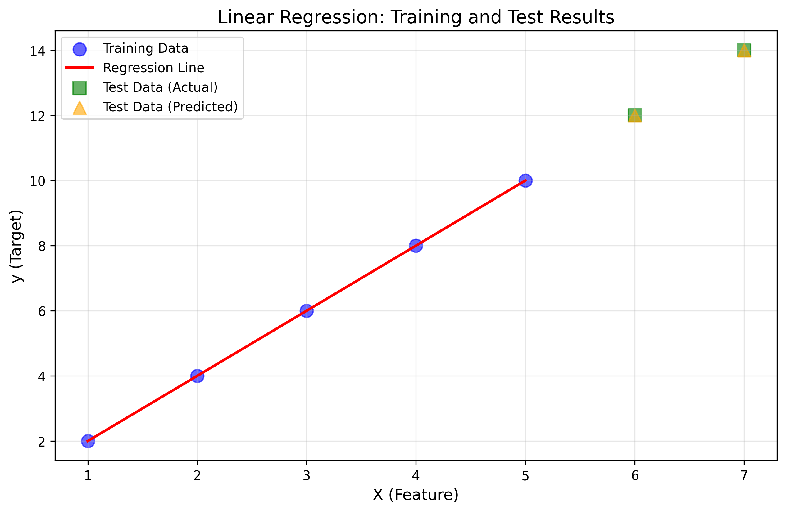

# 🧠 Linear Regression From Scratch

<div align="center">
  
  ### *My First Machine Learning Project*
  
  [](https://python.org)
  [](LICENSE)
  
</div>

## 📸 Demo


## 📋 Table of Contents
- [Overview](#-overview)
- [Installation](#-installation)
- [Usage](#-usage)
- [Results](#-results)
- [Structure](#-structure)
- [License](#-license)

## 🔍 Overview
This project implements a simple **Linear Regression** model to understand the fundamentals of machine learning. The model learns from sample data points and makes predictions on new inputs.

## ⚙️ Installation

```bash
# Clone the repository
git clone https://github.com/Vicky-YTZ/linear-regression.git

# Install dependencies
pip install -r requirements.txt